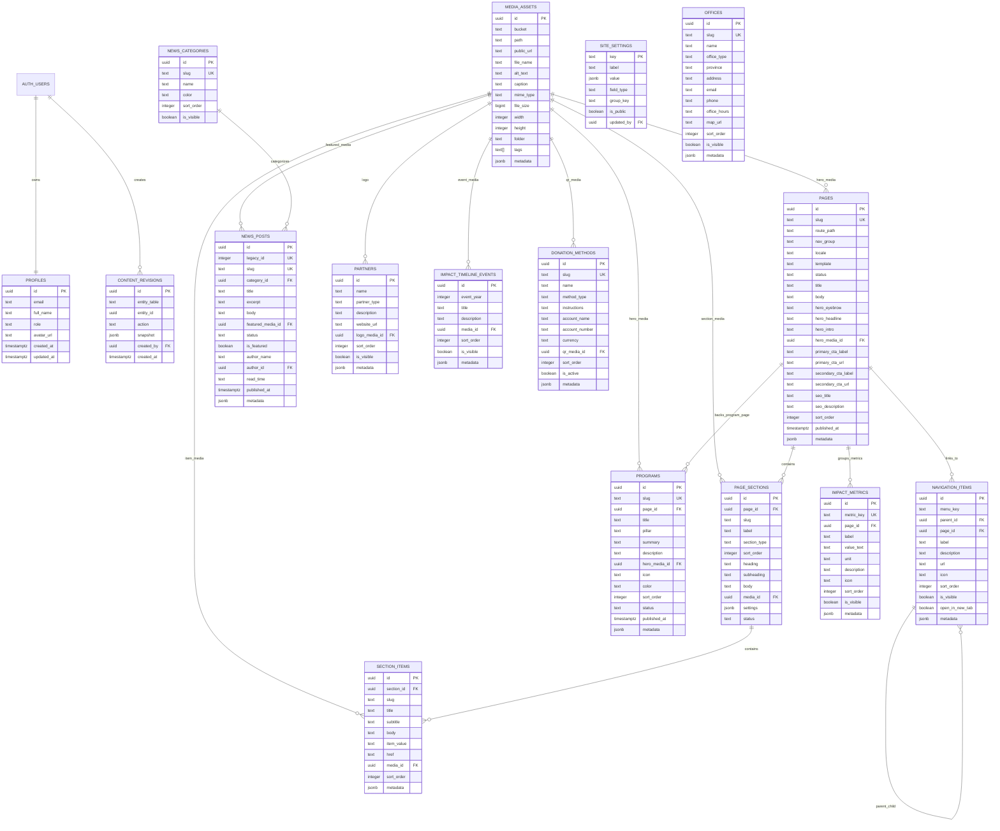

# Admin CMS ERD

```mermaid
erDiagram
  AUTH_USERS ||--|| PROFILES : owns
  AUTH_USERS ||--o{ CONTENT_REVISIONS : creates

  MEDIA_ASSETS ||--o{ PAGES : hero_media
  MEDIA_ASSETS ||--o{ PAGE_SECTIONS : section_media
  MEDIA_ASSETS ||--o{ SECTION_ITEMS : item_media
  MEDIA_ASSETS ||--o{ PROGRAMS : hero_media
  MEDIA_ASSETS ||--o{ NEWS_POSTS : featured_media
  MEDIA_ASSETS ||--o{ PARTNERS : logo
  MEDIA_ASSETS ||--o{ IMPACT_TIMELINE_EVENTS : event_media
  MEDIA_ASSETS ||--o{ DONATION_METHODS : qr_media

  PAGES ||--o{ PAGE_SECTIONS : contains
  PAGE_SECTIONS ||--o{ SECTION_ITEMS : contains
  PAGES ||--o{ NAVIGATION_ITEMS : links_to
  NAVIGATION_ITEMS ||--o{ NAVIGATION_ITEMS : parent_child
  PAGES ||--o{ PROGRAMS : backs_program_page
  PAGES ||--o{ IMPACT_METRICS : groups_metrics

  NEWS_CATEGORIES ||--o{ NEWS_POSTS : categorizes

  PROFILES {
    uuid id PK
    text email
    text full_name
    text role
    text avatar_url
    timestamptz created_at
    timestamptz updated_at
  }

  PAGES {
    uuid id PK
    text slug UK
    text route_path
    text nav_group
    text locale
    text template
    text status
    text title
    text body
    text hero_eyebrow
    text hero_headline
    text hero_intro
    uuid hero_media_id FK
    text primary_cta_label
    text primary_cta_url
    text secondary_cta_label
    text secondary_cta_url
    text seo_title
    text seo_description
    integer sort_order
    timestamptz published_at
    jsonb metadata
  }

  PAGE_SECTIONS {
    uuid id PK
    uuid page_id FK
    text slug
    text label
    text section_type
    integer sort_order
    text heading
    text subheading
    text body
    uuid media_id FK
    jsonb settings
    text status
  }

  SECTION_ITEMS {
    uuid id PK
    uuid section_id FK
    text slug
    text title
    text subtitle
    text body
    text item_value
    text href
    uuid media_id FK
    integer sort_order
    jsonb metadata
  }

  MEDIA_ASSETS {
    uuid id PK
    text bucket
    text path
    text public_url
    text file_name
    text alt_text
    text caption
    text mime_type
    bigint file_size
    integer width
    integer height
    text folder
    text[] tags
    jsonb metadata
  }

  NAVIGATION_ITEMS {
    uuid id PK
    text menu_key
    uuid parent_id FK
    uuid page_id FK
    text label
    text description
    text url
    text icon
    integer sort_order
    boolean is_visible
    boolean open_in_new_tab
    jsonb metadata
  }

  SITE_SETTINGS {
    text key PK
    text label
    jsonb value
    text field_type
    text group_key
    boolean is_public
    uuid updated_by FK
  }

  PROGRAMS {
    uuid id PK
    text slug UK
    uuid page_id FK
    text title
    text pillar
    text summary
    text description
    uuid hero_media_id FK
    text icon
    text color
    integer sort_order
    text status
    timestamptz published_at
    jsonb metadata
  }

  NEWS_CATEGORIES {
    uuid id PK
    text slug UK
    text name
    text color
    integer sort_order
    boolean is_visible
  }

  NEWS_POSTS {
    uuid id PK
    integer legacy_id UK
    text slug UK
    uuid category_id FK
    text title
    text excerpt
    text body
    uuid featured_media_id FK
    text status
    boolean is_featured
    text author_name
    uuid author_id FK
    text read_time
    timestamptz published_at
    jsonb metadata
  }

  PARTNERS {
    uuid id PK
    text name
    text partner_type
    text description
    text website_url
    uuid logo_media_id FK
    integer sort_order
    boolean is_visible
    jsonb metadata
  }

  IMPACT_METRICS {
    uuid id PK
    text metric_key UK
    uuid page_id FK
    text label
    text value_text
    text unit
    text description
    text icon
    integer sort_order
    boolean is_visible
    jsonb metadata
  }

  IMPACT_TIMELINE_EVENTS {
    uuid id PK
    integer event_year
    text title
    text description
    uuid media_id FK
    integer sort_order
    boolean is_visible
    jsonb metadata
  }

  OFFICES {
    uuid id PK
    text slug UK
    text name
    text office_type
    text province
    text address
    text email
    text phone
    text office_hours
    text map_url
    integer sort_order
    boolean is_visible
    jsonb metadata
  }

  DONATION_METHODS {
    uuid id PK
    text slug UK
    text name
    text method_type
    text instructions
    text account_name
    text account_number
    text currency
    uuid qr_media_id FK
    integer sort_order
    boolean is_active
    jsonb metadata
  }

  CONTENT_REVISIONS {
    uuid id PK
    text entity_table
    uuid entity_id
    text action
    jsonb snapshot
    uuid created_by FK
    timestamptz created_at
  }
```
